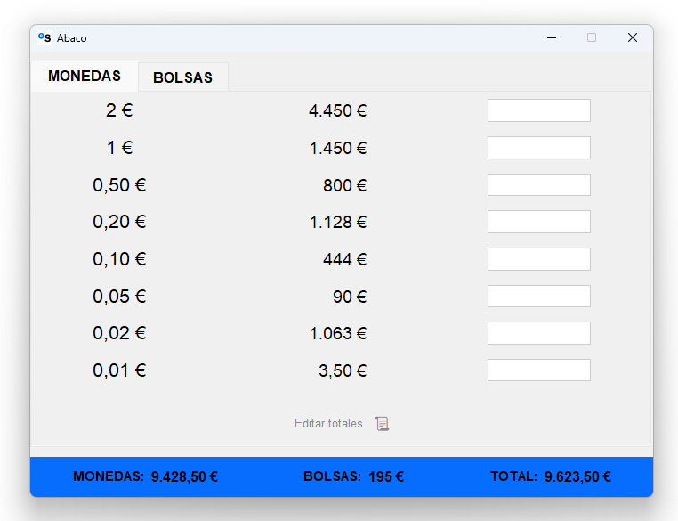
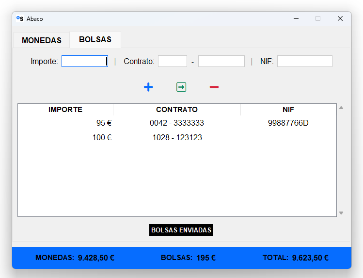
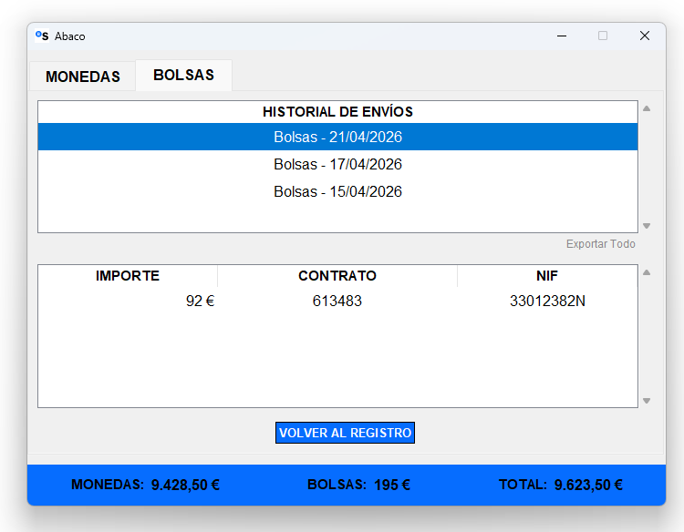

# Ábaco: Operational Efficiency & Cash Management System

**Ábaco** es una solución de software diseñada para la **digitalización del flujo de caja físico** en entornos de banca comercial. Desarrollado originalmente para resolver ineficiencias críticas detectadas en la red de oficinas comerciales, el sistema sustituye procesos manuales (papel/Excel) por un entorno digital íntegro, eliminando el riesgo operativo y garantizando la trazabilidad del dato.

---

## El Problema de Negocio (Business Case)
En la banca tradicional, el arqueo diario de efectivo (monedas y bolsas) suele gestionarse mediante procesos analógicos. Esto conlleva tres riesgos críticos:
1. **Riesgo Operativo:** Errores humanos en el recuento y consolidación que afectan al balance de cierre.
2. **Cero Trazabilidad:** Dificultad para auditar históricos de envíos y movimientos de caja.
3. **Costo de Oportunidad:** Pérdida de tiempo comercial (gestores "picando" datos manualmente).

**Ábaco** reduce el tiempo de proceso en un **90%** y garantiza **integridad total de los datos**.

---

## Funcionalidades Core (Enterprise-Ready)

| Módulo | Impacto de Negocio | Descripción Técnica |
| :--- | :--- | :--- |
| **Control de Divisa** | Precisión Contable | Gestión de saldos por denominación (0,01€–2€) con actualización atómica. |
| **Gestión de Bolsas** | Cumplimiento (KYC/AML) | Registro persistente de ingresos con vinculación de Contrato y NIF del cliente. |
| **Logística de Envíos** | Optimización de Flujo | Agrupación de efectivo en lotes para transporte de fondos con capacidad de reversión. |
| **Snapshot Diario** | Auditoría | Captura del estado de caja al inicio de jornada (Point-in-time recovery). |
| **Arqueo en Tiempo Real** | Visibilidad Total | Consolidación instantánea de Monedas + Bolsas + Gran Total. |
| **Data Export** | Business Intelligence | Exportación a CSV compatible con pipelines de análisis externo (Power BI/Excel). |

---

## Arquitectura y Decisiones de Ingeniería

El sistema ha sido diseñado bajo principios de **bajo acoplamiento** y **alta cohesión**, priorizando la estabilidad en entornos corporativos con restricciones de software.

* **Zero-Dependency Stack:** Desarrollado exclusivamente con la librería estándar de Python 3.10+. Esto permite una implementación inmediata en equipos bancarios sin necesidad de permisos de administrador para instalar paquetes externos (`pip`).
* **Aritmética de Precisión Financiera:** Implementación de cálculo basado en **enteros (céntimos)** para mitigar los errores de punto flotante inherentes a los tipos `float` en transacciones monetarias.
* **Persistencia Robusta (SQLite3):** Diseño de esquema relacional con tres tablas normalizadas. Uso de sentencias **UPSERT nativas** para prevenir condiciones de carrera (race conditions) en la actualización de saldos.
* **Arquitectura Desacoplada:** Separación estricta entre `database.py` (Capa de persistencia/Lógica de datos) y `ui.py` (Capa de presentación). La lógica de datos es agnóstica a la interfaz, facilitando una futura migración a entornos Web o API.

---

## Despliegue y Seguridad

* **Instalación "Zero-Touch":** No requiere configuración de entorno.
* **Seguridad de Instancia:** Implementación de bloqueo vía socket en `localhost` para impedir múltiples ejecuciones concurrentes que puedan corromper la base de datos local.
* **Validación de Entrada:** Sistema de `validatecommand` en UI para saneamiento de inputs en tiempo real, impidiendo la inyección de caracteres no numéricos.

```bash
# Clonar y ejecutar (Sin dependencias externas)
git clone [https://github.com/marbul33/abaco.git](https://github.com/marbul33/abaco.git)
cd abaco
python src/ui.py
```
La base de datos se crea automáticamente en el primer arranque en 
`%LOCALAPPDATA%\Abacus_Data\arqueo_local.db`.

No se requiere ningún `pip install`.

## Capturas




---

*Proyecto personal desarrollado para uso formativo. Todos los datos son
fictícios y simulados. En ningún caso se han usado datos de contratos reales.*
